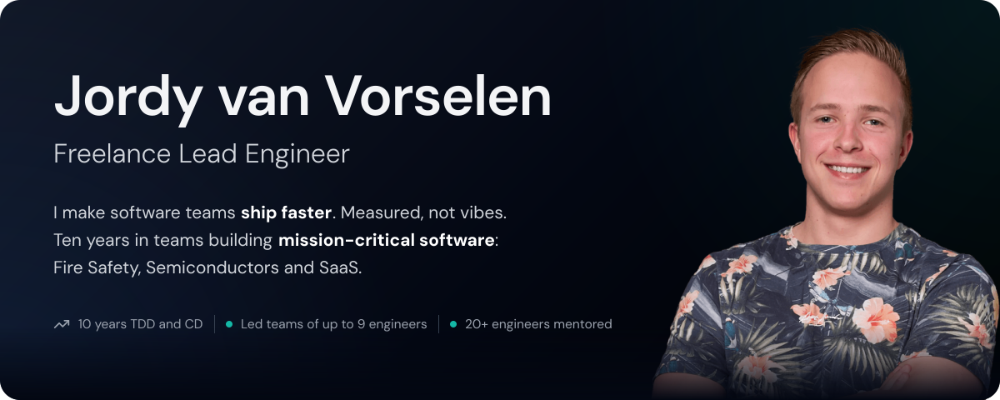

  

     

### I make the whole team ship faster.

Not by typing faster. By installing the rails that let a team **trust its own speed**:

- ✅ &nbsp;**Acceptance tests** as the definition of correct
- 🚦 &nbsp;**CI that blocks slop** before a human reviews it
- 📦 &nbsp;**Releases so small** they are boring

AI writes the code now. 
These rails decide where that speed goes: **to your users**, or into review queues and rework.

> [!TIP]
> **Hiring for a team that needs to go faster?** I measure where your delivery leaks, install the fix with your engineers, and prove it in numbers. → [jordy@vanvorselen.com](mailto:jordy@vanvorselen.com)

## 📈 Results, measured

From one of the teams I led, measured from its Git history:

<table>
<tr>
<td width="33%" align="center" valign="top">

# 9.9×

**More releases** per year

Next: multiple a day

</td>
<td width="33%" align="center" valign="top">

# 2.5×

**More shipped** in 12 months

Same team size

</td>
<td width="33%" align="center" valign="top">

# 10,000+

**Automated tests**

Full suite green in 20 min

</td>
</tr>
</table>

 

  

## 🧰 Stack

**Concepts over syntax.** I go deep on architecture and hard technical problems. Languages are the easy part, especially with AI.

Shipped to production with:

<table>
  <tr><td width="240">🔤 <b>Languages</b></td><td></td></tr>
  <tr><td>🧱 <b>Frameworks</b></td><td></td></tr>
  <tr><td>⚙️ <b>Systems</b></td><td></td></tr>
  <tr><td>🤖 <b>AI tooling I actually use</b></td><td>     </td></tr>
  <tr><td>🔌 <b>Harness plugins I authored</b></td><td>  </td></tr>
</table>

## ✍️ Writing

<!-- WRITING:START -->
| | Article | Published |
|:-:|---|:-:|
| 🆕 | **[Why your team gets slower every time a senior leaves](https://jordyvanvorselen.substack.com/p/why-your-team-gets-slower)** Their workflow left with them. Here’s how to keep it. | `24 Sep 2026` |
| 📝 | **[Agents don’t care about your instructions](https://jordyvanvorselen.substack.com/p/agents-dont-care-about-your-instructions)** Your agent ignores CLAUDE.md. Here's what it can't ignore. | `22 Aug 2026` |
| 📝 | **[Migrate Contentful to PayloadCMS with a single prompt](https://jordyvanvorselen.com/blog/migrate-contentful-to-payloadcms-with-a-single-prompt)** A battle-tested AI agent prompt that migrates your blog from Contentful to PayloadCMS — no 47-step tutorial required. | `10 Feb 2026` |
| 📝 | **[Factories: Clean Test Data Without the Pain](https://jordyvanvorselen.com/blog/factories-clean-test-data-without-the-pain)** Tired of brittle test setups and copy-pasted builders? Learn how to manage unit test data with maintainable, flexible factories. This guide walks... | `22 Jul 2025` |
| 📝 | **[The Copy-Paste Mindset](https://jordyvanvorselen.com/blog/the-copy-paste-mindset)** Creating a bordered box around your own knowledge is ruining your potential. Screw job titles, we engineers are here to help our customers by... | `08 Jul 2025` |
<!-- WRITING:END -->

## 📬 Connect

     

 

  <i>“A language that doesn't affect the way you think about programming is not worth knowing.”</i>
   
  Alan J. Perlis, first recipient of the Turing Award

  

